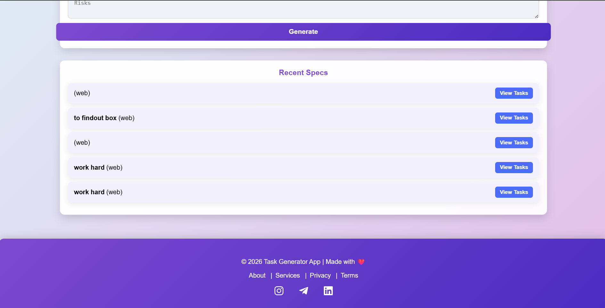
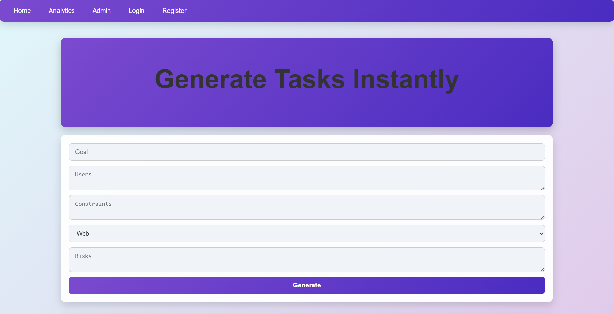

# Task Generator


A **full-stack MERN (MongoDB, Express, React, Node.js) application** to create, manage, and track task specifications. This project includes **user authentication**, **role-based access (admin/user)**, and a responsive, modern UI.

---

## **Features**

- User authentication and authorization (JWT-based)
- Role-based access:
  - **Admin**: view, edit, delete all specs, view analytics
  - **User**: create and view own specs
- Create, read, update, delete (CRUD) task specifications
- Recent tasks display
- Analytics dashboard for admins:
  - Total specs
  - Total tasks
  - Template statistics
  - Daily created specs
  - Average tasks per spec
- Responsive and animated UI

---

## **Tech Stack**

- **Frontend:** React, Axios, React Router DOM  
- **Backend:** Node.js, Express  
- **Database:** MongoDB (Mongoose)  
- **Authentication:** JWT (JSON Web Tokens)  
- **Styling:** CSS with animations  

---

## **Screenshots**

**Register Page**  


**Task Page**  


**Admin Panel**  


---


## **Project Structure**

task-generator/
│
├─ client/ # React frontend
│ ├─ src/
│ │ ├─ pages/ # Login, AdminPanel, etc.
│ │ ├─ components/ # Reusable components
│ │ └─ App.jsx
│ ├─ package.json
│
├─ server/ # Node.js backend
│ ├─ models/ # Mongoose schemas (User, Spec)
│ ├─ routes/ # API routes
│ ├─ middleware/ # Auth & admin middlewares
│ └─ server.js # Entry point
│ ├─ package.json
│
├─ .gitignore
└─ README.md


## **Getting Started**

### 1. Clone the repository
```bash
git clone https://github.com/your-username/task-generator.git
cd task-generator

# Backend
cd server
npm install

# Frontend
cd ../client
npm install

##.env file
MONGO_URI=your_mongodb_connection_string
JWT_SECRET=your_secret_key
PORT=5000


# Backend
cd server
npm run dev

# Frontend
cd ../client
npm start


